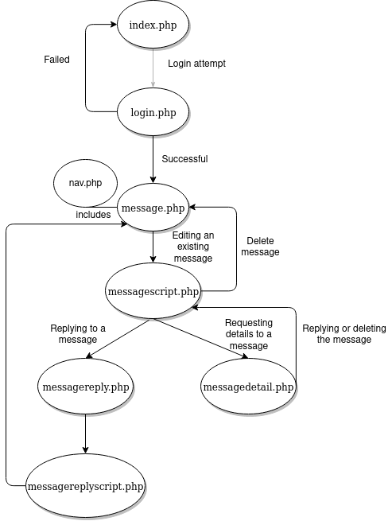
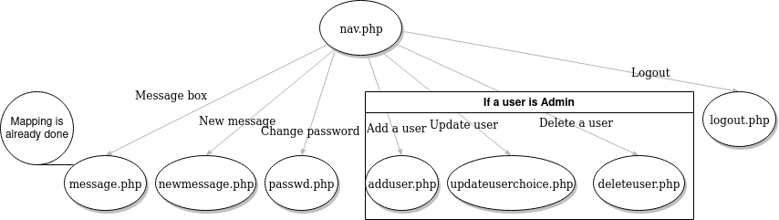
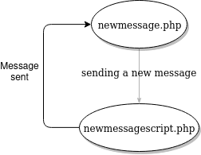
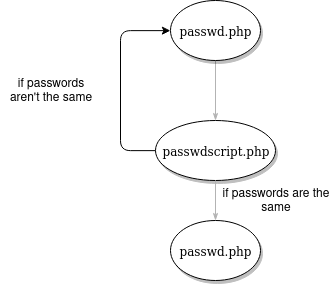
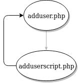
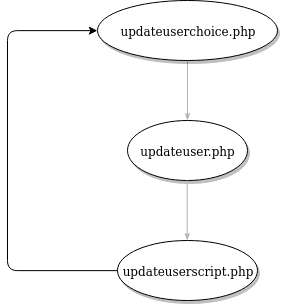
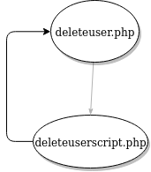
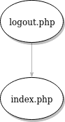
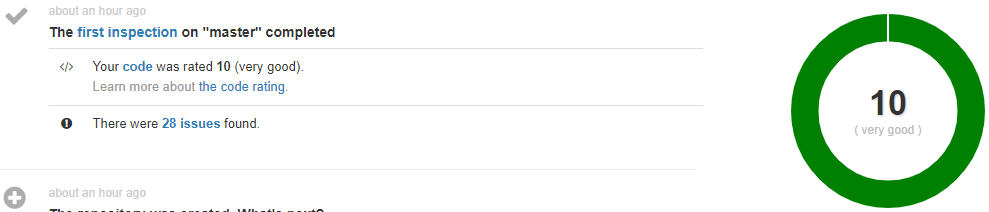

# STI - Projet 2 

# Auteurs : Nair Alic - Jeremy Zerbib

## Identification de menaces et correction de faille dans une application WEB

### Manuel utilisateur

L'ancien document détaillant l'utilisation du site se trouve [ici](./docs/old_README.md).

### Etude de menace

#### Analyse de prime abord

- Mapping de l'application et quels appels sont faits à quel moment.
- Nous avons essayé de *sniffer* des mots de passe avec `wireshark` et nous avons trouvé que ces derniers sont envoyés en clair.
- Ensuite, nous avons essayé de faire des injections `XSS` et nous y arrivons avec succès.  
- SQL injection ne marche pas à priori.
- Escalation de privilèges facile à faire lors de la création d'un nouvel utilisateur sinon pas possible.
- Possiblité de lire les mails des autres utilisateurs.
- A priori pas de serveur d'application
- Analyse du code source et utilisation de techniques douteuses.

#### Analyse détaillée

##### Mapping de l'application

**Détails de l'analyse**

Nous avons choisi de faire un mapping depuis la page d'accueil. Sur cette page, nous voyons que le fichier *index.php* est appelé. Nous pouvons voir que ce fichier fait office de page de *login* et qu'aucune autre action ne peut être faite à  priori. Une fois authentifié, l'utilisateur a accès à la barre de navigation qui permet de faire toutes les actions demandées par le cahier des charges.

Vous pouvez trouver le mapping de l'application grâce aux illustrations ci-dessous : 

**Mapping de *index.php*** 

**Mapping de *nav.php***

**Mapping de *new message***

**Mapping de *passwd***

**Mapping de *adduser***

**Mapping de *updateuserchoice***

**Mapping de *deleteuser***

**Mapping de *logout***

##### Sauter les étapes de contrôles côté client

**Step by step analyse** 

**Scénario**

**Risques si cassé**

##### Attaque de l'authentification

**Step by step analyse** 

**Scénario**

**Risques si cassé**

##### Attaque de session

**Step by step analyse** 

**Scénario**

**Risques si cassé**

##### Attaque des contrôle d'accès

**Step by step analyse** 

**Scénario**

**Risques si cassé**

##### Attaque de la base de donnée

**Step by step analyse** 

**Scénario**

**Risques si cassé**

##### Attaque du back-end

**Step by step analyse** 

**Scénario**

**Risques si cassé**

##### Attaque de la logique d'application

**Step by step analyse** 

**Scénario**

**Risques si cassé**

##### Attaque côté utilisateur (XSS)

**Step by step analyse** 

**Scénario**

**Risques si cassé**

##### Autres techniques d'attaques 

**Step by step analyse** 

**Scénario**

**Risques si cassé**

##### Vulnérabilités dans le code source

**Détails de l'analyse**

Pour l'analyse du code source, nous avons utilisé 2 méthodes. La première a consisté l'utilisation d'une application tierce qui va analyser notre code source et nous renvoyer des éventuelles erreurs de codage/faille dans notre code. La 2ème a été une analyse de type "CTRL-F" faite à la main fichier par fichier (car il n'y a pas énormément de code et de fichier).

- Pour la première analyse, nous avons utilisé un outil en ligne qui s'intègre avec Github (https://scrutinizer-ci.com/). En effet, cette application va analysé fichier par fichier le code PHP et relevé les différents problèmes rencontrés. Après analyse, l'outil nous renvoie 28 problèmes. 11 de types "Mineur" et 17 de type "Inconnu". Les 11 problèmes de type "Mineur" sont que dans chacun de nos fichier PHP nous avons utilisé le tag de fermeture "?>". En effet, ce tag n'est pas nécessaire et il peut induire des problèmes si des espaces blancs sont accidentellement rajouté après ce tag.
  Les 17 autres problèmes de types "Unknown", renvoient tous ce problème : "`$db` is of type `SQLite3`, thus it always evaluated to `true`."  En effet, nous avons remarqué que dans la variable $db, on aura un type objet et va toujours renvoyé "true" et donc il ne va jamais rentrer dans le statement "if(!$db)". D'après l'outils, notre code est noté très bon.
  )
- Pour la deuxième analyse, nous avons effectué une revue de code à la main et avons relevé les problèmes potentiels suivants : 
  

 ### Patch de l'application

**Enumaration des fixs faits sur l'app**

**Comment on l'a fait ?** 

- Détail Faille par faille 

