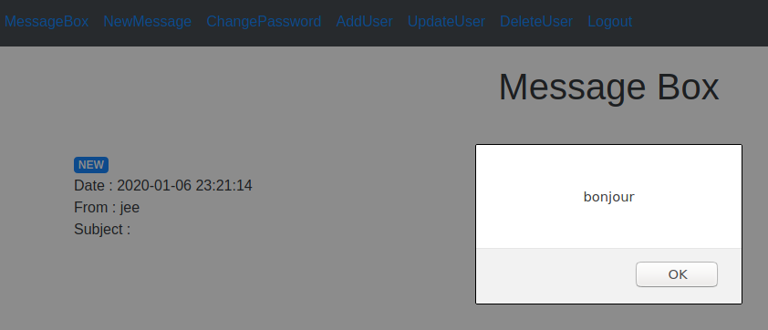

# STI - Projet 2 

# Auteurs : Nair Alic - Jeremy Zerbib

## Identification de menaces et correction de faille dans une application WEB

### Manuel utilisateur

L'ancien document détaillant l'utilisation du site se trouve [ici](./docs/old_README.md).

### Etude de menace

#### Analyse de prime abord

- Mapping de l'application et quels appels sont faits à quel moment.
- Nous avons essayé de *sniffer* des mots de passe avec `wireshark` et nous avons trouvé que ces derniers sont envoyés en clair.
- Ensuite, nous avons essayé de faire des injections `XSS` et nous y arrivons avec succès.  
- SQL injection ne marche pas à priori.
- Escalade de privilèges facile à faire lors de la création d'un nouvel utilisateur sinon pas possible.
- Possibilité de lire les mails des autres utilisateurs.
- A priori pas de serveur d'application
- Analyse du code source et utilisation de techniques douteuses.

#### Analyse détaillée

##### Mapping de l'application

**Détails de l'analyse**

Nous avons choisi de faire un *mapping* depuis la page d'accueil. Sur cette page, nous voyons que le fichier *`index.php`* est appelé. Nous pouvons voir que ce fichier fait office de page de *login* et qu'aucune autre action ne peut être faite à  priori. Une fois authentifié, l'utilisateur a accès à la barre de navigation qui permet de faire toutes les actions demandées par le cahier des charges.

Vous pouvez trouver le *mapping* de l'application grâce aux illustrations ci-dessous : 

**Mapping de *`index.php`* ** 

**Mapping de *`nav.php`* **

**Mapping de *`newmessage`* **

**Mapping de *`passwd`* **

**Mapping de *`adduser`* **

**Mapping de *`updateuserchoice`* **

**Mapping de *`deleteuser`* **

**Mapping de *`logout`* **

##### Sauter les étapes de contrôles côté client

**Risques si cassé**

Dans le cas où il serait possible de sauter des étapes côté client, il y a effectivement un gros risque. En effet,  sauter des étapes côté client peut entraîner une perte d'informations ou d'argent conséquente. En pratique, dans le cas d'un site de vente en ligne par exemple, sauter l'étape de paiement peut entrainer une perte monétaire.

Dans notre cas, il y a potentiellement un risque de perte de crédibilité et d'image publique avec un saut de l'étape de *login* par exemple. En effet, si un attaquant saute cette étape, il aura accès à un compte mail et pourra potentiellement avoir accès à toute la base de mails présente sur ce compte et en envoyer à de nouvelles personnes en se faisant passer pour quelqu'un d'autre.

**Analyse**

##### Attaque de l'authentification

**Risques si cassé**

L'authentification est le premier rempart basique de sécurité. Si ce rempart tombe, personne n'est en sécurité dans l'application. Tout le monde peut avoir accès à un compte d'une autre personne.

**Analyse** 

##### Attaque de session

**Risques si cassé**

Les risques sont grave si l'attaque de session aboutit. Il y a une possibilité de faire du vol de session et donc de se faire passer quelqu'un de légitime.

**Analyse**

##### Attaque des contrôles d'accès

**Risques si cassé**

Il y a une possibilité de casser la logique applicative, de faire de l'élévation de privilèges verticale et horizontale. De ce fait, il est possible d'avoir accès à certains fichiers sans forcément avoir le droit, de faire des paiements sans payer, avoir un compte `admin` sans avoir les droits.

**Analyse**

##### Attaque de la base de donnée

**Risques si cassé**

Dans le cas d'une vulnérabilité dans la conception de la base de données, un attaquant pourrait accéder à des données sensibles, (mots de passe, mails, etc.) modifier certains champs ou même si nous avons affaire à quelqu'un de mal intentionné, il pourrait détruire la base de données. 

**Analyse**

##### Attaque de la logique d'application

**Risques si cassé**

Si la logique est cassée, il y a une potentialité de sauter des étapes essentielles, usurper des identités, et donc une perte d'informations, d'argent ou de crédibilité pour l'entreprise.

**Analyse** 

##### Attaque côté utilisateur (XSS)

**Risques si cassé**

Il y a énormément de risques, les attaques `XSS` sont très malicieuses et peuvent ouvrir d'autres portes au niveau de l'application et de la base de données. Une élévation de privilèges, vol de session ou dump de la base donnée, voilà certaines applications d'une faille `XSS` exploitée. Ces failles sont très dangereuses et particulièrement répandues dans les formulaires.

**Analyse**

Pour tester si il y a possibilité de faire une attaque par `XSS`, il a été très facile de le démontrer car il y a énormément de champs vulnérables et il n'y a aucun contrôle au niveau des entrées utilisateurs.

En voici un exemple concret en ajoutant dans le champ "*subject*" le message suivant :``

Pour régler ce problème nous allons devoir instaurer un contrôle/validation au niveau des entrées utilisateurs. Il devra être HTML-encodé.

##### Autres techniques d'attaques

Dans ce cas, nous pouvons imaginer des attaques qui sont induites des actions utilisateur (CSRF, OSRF, etc.), qui modifient l'interface utilisateur en utilisant des `iframes` qui rendent d'aspect le site légitime (possibilité de contourner les tokens anti-CSRF par exemple). 

Nous pouvons aussi faire de l'injection afin de capturer des données là où le `XSS` n'a pas marché (injection d'`HTML`, de `CSS` ou contourner le `JavaScirpt`).

Des attaques basée sur le `CrossDomain` de `Flash` ou `Silverlight` sont aussi possible mais ce sont des technologies de moins en moins utilisées. En revanche, une attaque sur `HTML5` permettrait de faire du `CrossDomain` ce qui permettrait de faire des scans de ports sur la machine hôte ou même un `DDOS`.

Des injections dans le `header HTTP` permettrait de rajouter des entêtes voire même d'ajouter des cookies avec un `Set-Cookie`. Faire du `HTTP Response Splitting` est une possibilité aussi.

Faire du `Session Fixation` (grossièrement une sorte de vol de session) est aussi envisageable avec des token pas régénéré après une nouvelle  authentification ou des token pas mis à jour.

Des redirections ouvertes peuvent aussi être envisageable (surtout pour faire du trolling mais parfois ça peut être dangereux ...). 

Faire du contournement de token anti-CSRF avec du `HTTP parameter pollution`.

Des attaques de locales peuvent être faites sur l'historique, le contenu caché, les cookies persistant, l'autocomplétion, les objets partagés `Flash` locaux ou le stockage `Silverlight` isolé.

Finalement, des `keyloggers` peuvent être utilisés sur le navigateur directement, ainsi que du vol d'historique, scans de ports, des attaques de hôtes réseau, de l'exploitation de service non-HTTP ou l'exploitation des vulnérabilités du navigateur directement.

**Risque si cassé**

Globalement, toutes les attaques listées ci-dessus permettent de faire du vol de sessions, de l'élévation de privilèges, de casser ou de rendre indisponible les différents services d'une application. 

**Analyse**

Lors de notre analyse, nous nous sommes concentrés majoritairement sur les attaques de type `CSRF`. La raison de ce focus est dû au fait que nous ne pouvons attaquer les requêtes directement car il s'agit de `HTTPS` (en pratique c'est bien du `HTTP` mais dans la situation énoncées en classe, nous devions faire comme si nous attaquions du `HTTPS`).

Nous pouvons voir lors de notre revue du code que la présence de token anti-CSRF est inexistante. De ce fait, nous pouvons déduire qu'une attaque `CSRF` est plus que plausible. Nous n'avons pas réalisé de scénarios d'attaque par manque de temps mais le patch de cette vulnérabilité a été fait et sera expliqué plus tard dans le rapport.  

##### Vulnérabilités dans le code source

**Détails de l'analyse**

Pour l'analyse du code source, nous avons utilisé 2 méthodes. La première a consisté l'utilisation d'une application tierce qui va analyser notre code source et nous renvoyer des éventuelles erreurs de codage/faille dans notre code. La 2ème a été une analyse de type "CTRL-F" faite à la main fichier par fichier (car il n'y a pas énormément de code et de fichier).

- Pour la première analyse, nous avons utilisé un outil en ligne qui s'intègre avec Github (https://scrutinizer-ci.com/). En effet, cette application va analysé fichier par fichier le code PHP et relevé les différents problèmes rencontrés. Après analyse, l'outil nous renvoie 28 problèmes. 11 de types "Mineur" et 17 de type "Inconnu". Les 11 problèmes de type "Mineur" sont que dans chacun de nos fichier PHP nous avons utilisé le tag de fermeture "?>". En effet, ce tag n'est pas nécessaire et il peut induire des problèmes si des espaces blancs sont accidentellement rajouté après ce tag.
  Les 17 autres problèmes de types "Unknown", renvoient tous ce problème : "`$db` is of type `SQLite3`, thus it always evaluated to `true`."  En effet, nous avons remarqué que dans la variable $db, on aura un type objet et va toujours renvoyé "true" et donc il ne va jamais rentrer dans le statement "if(!$db)". D'après l'outils, notre code est noté très bon.
  )
- Pour la deuxième analyse, nous avons effectué une revue de code à la main et avons relevé les problèmes potentiels suivants : 
  Après une revue du code à la main, nous avons constaté que nous pouvions améliorer nos requêtes SQL avec des "`Prepared Statement`", en effet cela va permettre d'éliminer les injections SQL. Nous avons aussi remarqué dans le code source que les *passwords* circulent clairs dans les variables et qu'un fichier contient les comptes avec mot de passe par défaut. Nous pourrions améliorer ceci, en laissant uniquement 1 utilisateur par défaut, et ou il devra changer de mot de passe après le premier login. Et aussi chiffrer les mots de passe au login et pendant les mise à jour.

 ### Patch de l'application

**Énumération des corrections faites sur l'application**

**Comment on l'a fait ?** 

- Correction des failles XSS
- Correction des failles CSRF
- Correction des failles d'élévation de privilèges
- Correction des problèmes PHP technique

